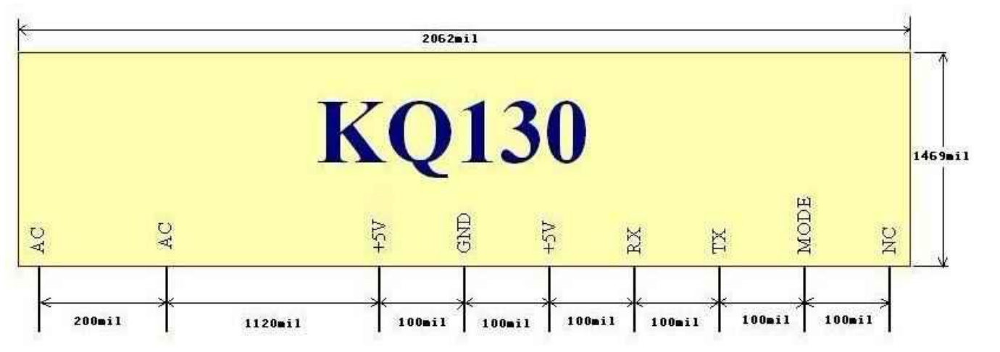
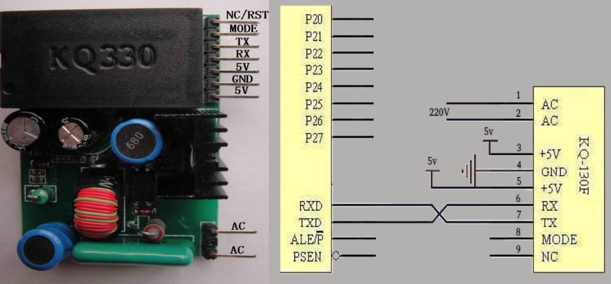
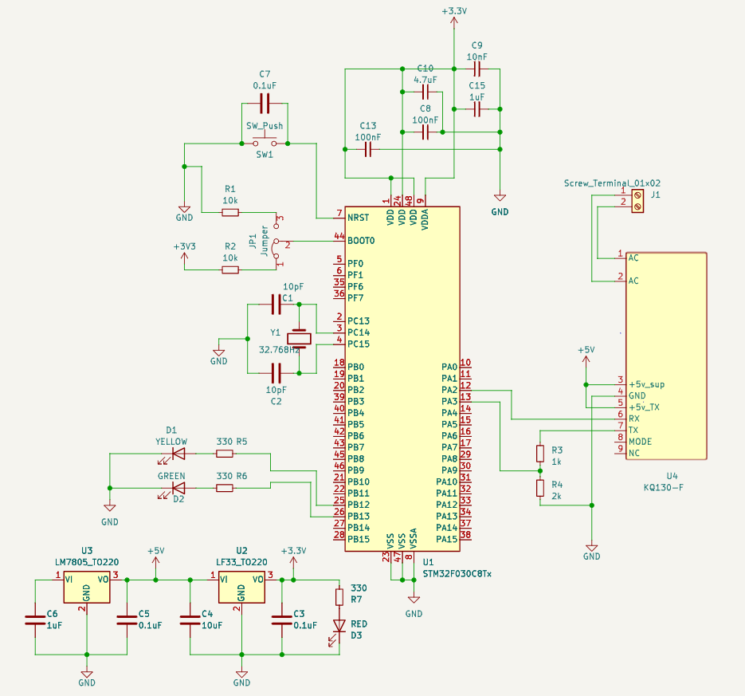
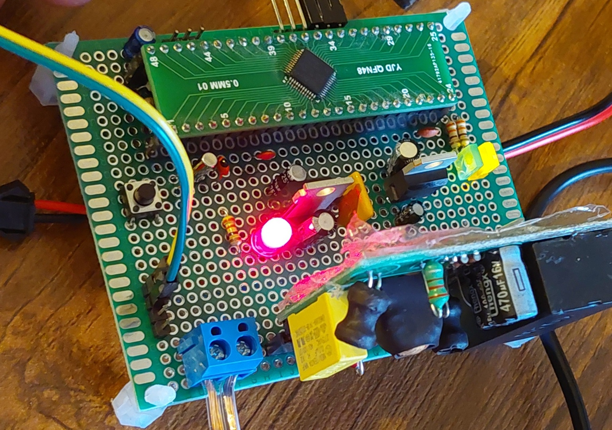
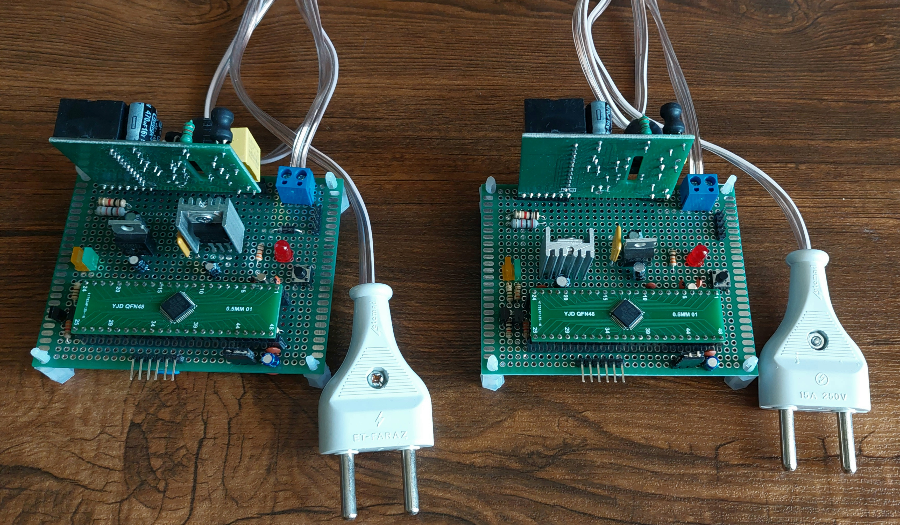

# plNIC using KQ130F FSK modem
The under developed plNIC will provide encryption, DMA, buffering techniques, CRC error checking and RTOS(FreeRTOS).

## Hardware

### KQ130-F
This PLM has fairly simple application and interface circuit, Though it is not provided with enough and clear documentations. Here is the pinout:

As it's shown; there is 9 pins in total and that pins 1 and 2 are connected to AC powerline(No matter you connect phase wire or neutral wire to pin 1 or 2), pins 3, 4 and 5 provides power and pin 6 and 7 are used for data communication. 
 

The figure above shows connections for AT89C51 MCU which uses TTL logic level. Remember that this PLM suppots TTL logical voltage levels so you need a voltage devider if you want to use it with a 3.3v MCU like STM32 MCUs. I used <a href="https://en.wikipedia.org/wiki/Voltage_divider#:~:text=Resistor%20voltage%20dividers%20are%20commonly,signal%20attenuators%20at%20low%20frequencies." title="Resistor Voltage Devider">Resistor Voltage Devider</a> to convert 5v TTL to 3.3v in MCU rx <-> KQ130-F tx connection. However there is no need to do so for MCU tx <-> KQ130-F rx. Resistor voltage devider is suitable for this application because baud rate of data signals are relatively very low. Otherwise we might need to use diode or FET based voltage converters or rather to use converter chips like <a href="https://www.sparkfun.com/products/12009" >this</a>.

### STM32F030C8
#### DMA
#### CRC
#### UART

### Schematic
The designed schematic of plNIC is shown bellow:

> __Note__ Due to Hi-Z state of pins, if using pin headers and detachable connections in my implementation of this schema, I recommend using a pull-up resistor on the base pin of transistors. So to pull the base pin to a logical one by default.

### Bill of Materials
BOM for every plNIC is as follows:
<table class="table table-bordered table-hover table-condensed">
<thead><tr><th title="Field #1">Reference</th>
<th title="Field #2">Value</th>
<th title="Field #3">Footprint</th>
<th title="Field #4">Qty</th>
</tr></thead>
<tbody><tr>
<td>C1, C2</td>
<td>10pF</td>
<td> </td>
<td align="right">2</td>
</tr>
<tr>
<td>C4</td>
<td>10uF</td>
<td> </td>
<td align="right">1</td>
</tr>
<tr>
<td>C3, C5, C7</td>
<td>0.1uF</td>
<td> </td>
<td align="right">3</td>
</tr>
<tr>
<td>C9</td>
<td>10nF</td>
<td> </td>
<td align="right">1</td>
</tr>
<tr>
<td>C10</td>
<td>4.7uF</td>
<td> </td>
<td align="right">1</td>
</tr>
<tr>
<td>C8, C13</td>
<td>100nF</td>
<td> </td>
<td align="right">2</td>
</tr>
<tr>
<td>C6, C15</td>
<td>1uF</td>
<td> </td>
<td align="right">2</td>
</tr>
<tr>
<td>D1</td>
<td>YELLOW</td>
<td> </td>
<td align="right">1</td>
</tr>
<tr>
<td>D2</td>
<td>GREEN</td>
<td> </td>
<td align="right">1</td>
</tr>
<tr>
<td>D3</td>
<td>RED</td>
<td> </td>
<td align="right">1</td>
</tr>
<tr>
<td>D4</td>
<td>1N4001</td>
<td>Diode_THT:D_DO-41_SOD81_P10.16mm_Horizontal</td>
<td align="right">1</td>
</tr>
<tr>
<td>J1</td>
<td>Screw_Terminal_01x02</td>
<td> </td>
<td align="right">1</td>
</tr>
<tr>
<td>J3</td>
<td>UART_DEBUG</td>
<td> </td>
<td align="right">1</td>
</tr>
<tr>
<td>J4</td>
<td>SW_DEBUG</td>
<td> </td>
<td align="right">1</td>
</tr>
<tr>
<td>J5</td>
<td>plNIC Interface</td>
<td> </td>
<td align="right">1</td>
</tr>
<tr>
<td>JP1</td>
<td>Jumper</td>
<td> </td>
<td align="right">1</td>
</tr>
<tr>
<td>Q1, Q2</td>
<td>BC327</td>
<td>Package_TO_SOT_THT:TO-92_Inline</td>
<td align="right">2</td>
</tr>
<tr>
<td>R1, R2</td>
<td>10k</td>
<td> </td>
<td align="right">2</td>
</tr>
<tr>
<td>R3</td>
<td>1k</td>
<td> </td>
<td align="right">1</td>
</tr>
<tr>
<td>R4</td>
<td>2k</td>
<td> </td>
<td align="right">1</td>
</tr>
<tr>
<td>R5, R6</td>
<td>150</td>
<td> </td>
<td align="right">2</td>
</tr>
<tr>
<td>R7</td>
<td>330</td>
<td> </td>
<td align="right">1</td>
</tr>
<tr>
<td>R8, R9</td>
<td>3K2</td>
<td> </td>
<td align="right">2</td>
</tr>
<tr>
<td>SW1</td>
<td>SW_Push</td>
<td> </td>
<td align="right">1</td>
</tr>
<tr>
<td>TH1</td>
<td>800mA PTC</td>
<td> </td>
<td align="right">1</td>
</tr>
<tr>
<td>U1</td>
<td>STM32F030C8Tx</td>
<td>Package_QFP:LQFP-48_7x7mm_P0.5mm</td>
<td align="right">1</td>
</tr>
<tr>
<td>U2</td>
<td>LF33_TO220</td>
<td>Package_TO_SOT_THT:TO-220-3_Vertical</td>
<td align="right">1</td>
</tr>
<tr>
<td>U3</td>
<td>LM7805_TO220</td>
<td>Package_TO_SOT_THT:TO-220-3_Vertical</td>
<td align="right">1</td>
</tr>
<tr>
<td>U4</td>
<td>KQ130-F</td>
<td> </td>
<td align="right">1</td>
</tr>
<tr>
<td>Y1</td>
<td>32.768Hz</td>
<td> </td>
<td align="right">1</td>
</tr>
</tbody></table>

Implementation Specific parts:
<table class="table table-bordered table-hover table-condensed">
<thead><tr><th title="Field #1">Reference</th>
<th title="Field #2">Value</th>
<th title="Field #3">Footprint</th>
<th title="Field #4">Qty</th>
</tr></thead>
<tbody><tr>
<td>Hole Board</td>
<td>9cm * 7cm double sided</td>
<td> </td>
<td align="right">1</td>
</tr>
<tr>
<td>SMD to DIP</td>
<td>QFN48 to DIP package converter</td>
<td> </td>
<td align="right">1</td>
</tr>
</tbody></table>

### Implemented Module
The discussed plNIC soldered on double sided hole board as bellow:

>__Warning__  The ambiguous insufficient documentation of this Chinese modem, which I provided in Docs/Texts, states that the maximum current crossing the modem is about 300mA. Though my tests reveal effectively more current passing it. This misinformation made me use a heat sink after board soldering, which was a trouble, as it gets necessary. So be careful about it. 

>__Note__ This website has useful information to calculate Total Thermal Resistance(θJA(TOTAL)) and need of heat sink: https://www.petervis.com/electronics/Voltage_Regulator_Heatsink/Heatsink_for_TO-220_Voltage_Regulator.html

#### Final Version 
Based on the above explanation, version 1.4 of plNIC board designed and looks like this:

>__Note__ There is also another neat approach to this problem. The problem should get solved by using multiple (2 should be enough) LM7805 regulators in parallel to supply current to this current beast. (However I've not tested, It is a more promising solution because you should not need heat sinks and can lower the input voltage, as well)

## Software

=======
# plNIC using KQ130F FSK modem
The under developed plNIC will provide encryption, DMA, buffering techniques, CRC error checking and RTOS(FreeRTOS).

## Hardware

### KQ130-F
This PLM has fairly simple application and interface circuit, Though it is not provided with enough and clear documentations. Here is the pinout:

As it's shown; there is 9 pins in total and that pins 1 and 2 are connected to AC powerline(No matter you connect phase wire or neutral wire to pin 1 or 2), pins 3, 4 and 5 provides power and pin 6 and 7 are used for data communication. 
 

The figure above shows connections for AT89C51 MCU which uses TTL logic level. Remember that this PLM suppots TTL logical voltage levels so you need a voltage devider if you want to use it with a 3.3v MCU like STM32 MCUs. I used <a href="https://en.wikipedia.org/wiki/Voltage_divider#:~:text=Resistor%20voltage%20dividers%20are%20commonly,signal%20attenuators%20at%20low%20frequencies." title="Resistor Voltage Devider">Resistor Voltage Devider</a> to convert 5v TTL to 3.3v in MCU rx <-> KQ130-F tx connection. However there is no need to do so for MCU tx <-> KQ130-F rx. Resistor voltage devider is suitable for this application because baud rate of data signals are relatively very low. Otherwise we might need to use diode or FET based voltage converters or rather to use converter chips like <a href="https://www.sparkfun.com/products/12009" >this</a>.

### STM32F030C8
#### DMA
#### CRC
#### UART

### Schematic
The designed schematic of plNIC is shown bellow:

> __Note__ Due to Hi-Z state of pins, if using pin headers and detachable connections in my implementation of this schema, I recommend using a pull-up resistor on the base pin of transistors. So to pull the base pin to a logical one by default.

### Bill of Materials
BOM for every plNIC is as follows:
<table class="table table-bordered table-hover table-condensed">
<thead><tr><th title="Field #1">Reference</th>
<th title="Field #2">Value</th>
<th title="Field #3">Footprint</th>
<th title="Field #4">Qty</th>
</tr></thead>
<tbody><tr>
<td>C1, C2</td>
<td>10pF</td>
<td> </td>
<td align="right">2</td>
</tr>
<tr>
<td>C4</td>
<td>10uF</td>
<td> </td>
<td align="right">1</td>
</tr>
<tr>
<td>C3, C5, C7</td>
<td>0.1uF</td>
<td> </td>
<td align="right">3</td>
</tr>
<tr>
<td>C9</td>
<td>10nF</td>
<td> </td>
<td align="right">1</td>
</tr>
<tr>
<td>C10</td>
<td>4.7uF</td>
<td> </td>
<td align="right">1</td>
</tr>
<tr>
<td>C8, C13</td>
<td>100nF</td>
<td> </td>
<td align="right">2</td>
</tr>
<tr>
<td>C6, C15</td>
<td>1uF</td>
<td> </td>
<td align="right">2</td>
</tr>
<tr>
<td>D1</td>
<td>YELLOW</td>
<td> </td>
<td align="right">1</td>
</tr>
<tr>
<td>D2</td>
<td>GREEN</td>
<td> </td>
<td align="right">1</td>
</tr>
<tr>
<td>D3</td>
<td>RED</td>
<td> </td>
<td align="right">1</td>
</tr>
<tr>
<td>D4</td>
<td>1N4001</td>
<td>Diode_THT:D_DO-41_SOD81_P10.16mm_Horizontal</td>
<td align="right">1</td>
</tr>
<tr>
<td>J1</td>
<td>Screw_Terminal_01x02</td>
<td> </td>
<td align="right">1</td>
</tr>
<tr>
<td>J3</td>
<td>UART_DEBUG</td>
<td> </td>
<td align="right">1</td>
</tr>
<tr>
<td>J4</td>
<td>SW_DEBUG</td>
<td> </td>
<td align="right">1</td>
</tr>
<tr>
<td>J5</td>
<td>plNIC Interface</td>
<td> </td>
<td align="right">1</td>
</tr>
<tr>
<td>JP1</td>
<td>Jumper</td>
<td> </td>
<td align="right">1</td>
</tr>
<tr>
<td>Q1, Q2</td>
<td>BC327</td>
<td>Package_TO_SOT_THT:TO-92_Inline</td>
<td align="right">2</td>
</tr>
<tr>
<td>R1, R2</td>
<td>10k</td>
<td> </td>
<td align="right">2</td>
</tr>
<tr>
<td>R3</td>
<td>1k</td>
<td> </td>
<td align="right">1</td>
</tr>
<tr>
<td>R4</td>
<td>2k</td>
<td> </td>
<td align="right">1</td>
</tr>
<tr>
<td>R5, R6</td>
<td>150</td>
<td> </td>
<td align="right">2</td>
</tr>
<tr>
<td>R7</td>
<td>330</td>
<td> </td>
<td align="right">1</td>
</tr>
<tr>
<td>R8, R9</td>
<td>3K2</td>
<td> </td>
<td align="right">2</td>
</tr>
<tr>
<td>SW1</td>
<td>SW_Push</td>
<td> </td>
<td align="right">1</td>
</tr>
<tr>
<td>TH1</td>
<td>800mA PTC</td>
<td> </td>
<td align="right">1</td>
</tr>
<tr>
<td>U1</td>
<td>STM32F030C8Tx</td>
<td>Package_QFP:LQFP-48_7x7mm_P0.5mm</td>
<td align="right">1</td>
</tr>
<tr>
<td>U2</td>
<td>LF33_TO220</td>
<td>Package_TO_SOT_THT:TO-220-3_Vertical</td>
<td align="right">1</td>
</tr>
<tr>
<td>U3</td>
<td>LM7805_TO220</td>
<td>Package_TO_SOT_THT:TO-220-3_Vertical</td>
<td align="right">1</td>
</tr>
<tr>
<td>U4</td>
<td>KQ130-F</td>
<td> </td>
<td align="right">1</td>
</tr>
<tr>
<td>Y1</td>
<td>32.768Hz</td>
<td> </td>
<td align="right">1</td>
</tr>
</tbody></table>

Implementation Specific parts:
<table class="table table-bordered table-hover table-condensed">
<thead><tr><th title="Field #1">Reference</th>
<th title="Field #2">Value</th>
<th title="Field #3">Footprint</th>
<th title="Field #4">Qty</th>
</tr></thead>
<tbody><tr>
<td>Hole Board</td>
<td>9cm * 7cm double sided</td>
<td> </td>
<td align="right">1</td>
</tr>
<tr>
<td>SMD to DIP</td>
<td>QFN48 to DIP package converter</td>
<td> </td>
<td align="right">1</td>
</tr>
</tbody></table>

### Implemented Module
The discussed plNIC soldered on double sided hole board as bellow:

>__Warning__  The ambiguous insufficient documentation of this Chinese modem, which I provided in Docs/Texts, states that the maximum current crossing the modem is about 300mA. Though my tests reveal effectively more current passing it. This misinformation made me use a heat sink after board soldering, which was a trouble, as it gets necessary. So be careful about it. 

>__Note__ This website has useful information to calculate Total Thermal Resistance(θJA(TOTAL)) and need of heat sink: https://www.petervis.com/electronics/Voltage_Regulator_Heatsink/Heatsink_for_TO-220_Voltage_Regulator.html

#### Final Version 
Based on the above explanation, version 1.4 of plNIC board designed and looks like this:

>__Note__ There is also another neat approach to this problem. The problem should get solved by using multiple (2 should be enough) LM7805 regulators in parallel to supply current to this current beast. (However I've not tested, It is a more promising solution because you should not need heat sinks and can lower the input voltage, as well)

## Software

>>>>>>> c3fde0be409cc44f593e10e7f06bbe1bde420a8a
